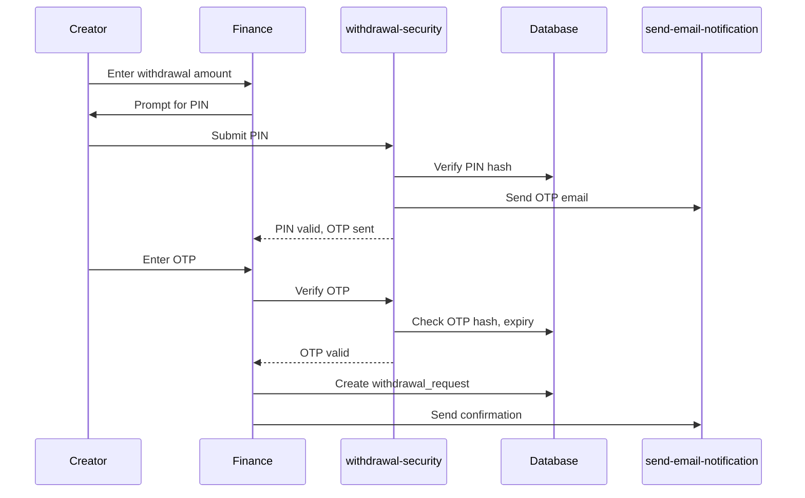

# TipKoro Developer Documentation

## Overview

TipKoro is a creator support platform built for Bangladesh, allowing fans to tip their favorite creators using local payment methods (bKash, Nagad, Rocket). Think "Buy Me a Coffee" but designed specifically for the Bangladeshi market.

**Live URL:** https://tipkoro.lovable.app  
**Custom Domain:** https://tipkoro.com

---

## Tech Stack

| Category | Technology | Version |
|----------|------------|---------|
| Frontend | React | 19.x |
| Language | TypeScript | 5.x |
| Build Tool | Vite | 5.x |
| Styling | Tailwind CSS | 3.x |
| Components | shadcn/ui | Latest |
| Auth | Clerk | @clerk/clerk-react ^5.58 |
| Database | Supabase | PostgreSQL 15 |
| Payments | RupantorPay | Custom API |
| Email | Resend | npm:resend@2.0.0 |
| State | TanStack Query | ^5.83 |
| Charts | Recharts | 2.15.4 |
| Routing | React Router | ^6.30 |

---

## Project Structure

```
tipkoro/
├── src/
│   ├── components/           # Reusable UI components
│   │   ├── ui/              # shadcn/ui primitives (button, card, dialog, etc.)
│   │   ├── admin/           # Admin-specific components (ReplyComposer.tsx)
│   │   └── icons/           # Custom icons (PaymentIcons.tsx)
│   ├── pages/               # Route pages
│   │   ├── admin/           # Admin panel (Dashboard, Users, Tips, Withdrawals, etc.)
│   │   └── payments/        # Payment result pages (Success, Failed)
│   ├── hooks/               # Custom React hooks
│   │   ├── useProfile.ts    # Current user profile
│   │   ├── useCreatorStats.ts   # Creator analytics
│   │   ├── useFundingGoals.ts   # Goal management
│   │   ├── useRealtimeTips.ts   # Live tip updates
│   │   └── useSupabaseWithAuth.ts  # Authenticated Supabase client
│   ├── integrations/
│   │   └── supabase/
│   │       ├── client.ts    # Supabase client initialization
│   │       └── types.ts     # Auto-generated TypeScript types
│   └── lib/
│       ├── utils.ts         # Utility functions (cn, formatters)
│       └── api.ts           # API helper functions
├── supabase/
│   ├── functions/           # Edge Functions (Deno runtime)
│   │   ├── clerk-webhook/       # Sync Clerk users to profiles
│   │   ├── complete-signup/     # Creator onboarding completion
│   │   ├── create-tip/          # Tip creation + goal tracking
│   │   ├── send-email-notification/  # All transactional emails
│   │   ├── weekly-summary/      # Weekly creator reports
│   │   ├── withdrawal-security/ # PIN & OTP verification
│   │   ├── rupantor-checkout/   # Payment session creation
│   │   ├── rupantor-webhook/    # Payment confirmation
│   │   ├── rupantor-verify/     # Payment status check
│   │   ├── resend-inbound-webhook/  # Incoming email handler
│   │   ├── send-reply-email/    # Admin email replies
│   │   ├── generate-share-image/    # Dynamic OG images
│   │   └── generate-sitemap/    # SEO sitemap
│   ├── migrations/          # Database schema changes (read-only)
│   └── config.toml          # Edge function configuration
├── public/
│   ├── llms.txt             # AI/LLM context file
│   ├── robots.txt           # SEO robots
│   └── sitemap.xml          # SEO sitemap
├── docs/                    # VitePress documentation site
└── dev.md                   # This file
```

---

## Core Features

### For Creators

| Feature | Location | Description |
|---------|----------|-------------|
| Profile Page | `src/pages/CreatorProfile.tsx` | Public tipping page at `/:username` |
| Dashboard | `src/pages/Dashboard.tsx` | Earnings overview, recent tips, quick actions |
| Finance | `src/pages/Finance.tsx` | Detailed earnings, withdrawals, balance |
| Settings | `src/pages/Settings.tsx` | Profile, links, notifications, security, billing |
| Funding Goals | `src/components/FundingGoalCard.tsx` | Create goals with milestone tracking |
| Verification | `src/components/VerificationForm.tsx` | ID verification for trust badge |
| Share Tools | `src/components/QRCodeDialog.tsx`, `EmbedCodeDialog.tsx`, `BioLinkDialog.tsx` | Promotional tools |

### For Supporters

| Feature | Location | Description |
|---------|----------|-------------|
| Tip Form | `src/components/TipKoroCard.tsx` | Main tipping interface |
| Payment | `src/pages/payments/TipPaymentSuccess.tsx` | Post-payment confirmation |
| Donation History | `src/components/SupporterDashboard.tsx` | View past donations (if logged in) |

### For Admins

| Feature | Location | Description |
|---------|----------|-------------|
| Dashboard | `src/pages/admin/AdminDashboard.tsx` | Platform overview |
| Users | `src/pages/admin/AdminUsers.tsx` | User management |
| Creators | `src/pages/admin/AdminCreators.tsx` | Creator management |
| Tips | `src/pages/admin/AdminTips.tsx` | All transactions |
| Withdrawals | `src/pages/admin/AdminWithdrawals.tsx` | Payout processing |
| Verifications | `src/pages/admin/AdminVerifications.tsx` | ID review |
| Mailbox | `src/pages/admin/AdminMailbox.tsx` | Inbound emails |
| Email Templates | `src/pages/admin/AdminEmailTemplates.tsx` | Customize emails |
| Share Image | `src/pages/admin/AdminShareImage.tsx` | OG image template |
| Settings | `src/pages/admin/AdminSettings.tsx` | Platform config |
| Admins | `src/pages/admin/AdminAdmins.tsx` | Admin role management |

---

## Database Schema

### Core Tables

```sql
-- User profiles (synced from Clerk)
profiles
├── id (uuid, PK)
├── user_id (text, unique) -- Clerk user ID
├── email, first_name, last_name, username
├── bio, avatar_url
├── twitter, instagram, youtube, facebook, other_link
├── account_type (enum: supporter, creator)
├── onboarding_status (enum: pending, account_type, payment, profile, completed)
├── is_verified, is_admin
├── total_received, total_supporters
├── withdrawal_pin_hash, withdrawal_pin_set_at
└── created_at, updated_at

-- Tip transactions
tips
├── id (uuid, PK)
├── creator_id (uuid, FK → profiles)
├── supporter_id (uuid, FK → profiles, nullable)
├── supporter_name, supporter_email
├── amount, currency (default: BDT)
├── message, is_anonymous
├── payment_status (pending, completed, failed)
├── payment_method, transaction_id
└── created_at

-- Creator funding goals
funding_goals
├── id (uuid, PK)
├── profile_id (uuid, FK → profiles)
├── title, description
├── target_amount, current_amount
├── is_active, start_date, end_date
└── created_at, updated_at

-- Withdrawal requests
withdrawal_requests
├── id (uuid, PK)
├── profile_id (uuid, FK → profiles)
├── amount, currency
├── payout_method (bkash, nagad, rocket, bank)
├── payout_details (jsonb)
├── status (pending, processing, completed, rejected)
├── notes, processed_at
└── created_at, updated_at
```

### Supporting Tables

```sql
-- Admin permissions
admin_roles
├── user_id (text, unique) -- Clerk user ID
├── can_view_dashboard, can_view_tips
├── can_manage_users, can_manage_creators
├── can_manage_withdrawals, can_manage_verifications
├── can_manage_mailbox, can_manage_settings
└── can_manage_admins (super admin only)

-- Platform configuration (JSONB key-value store)
platform_config
├── key (text, unique)
├── value (jsonb)
├── description
└── updated_at, updated_by

-- Email delivery tracking
email_logs
├── recipient_email, email_type
├── status (sent, failed)
├── resend_id, error_message
└── created_at

-- User notification preferences
notification_settings
├── profile_id (uuid, FK)
├── tips_enabled, withdrawals_enabled, promotions_enabled
└── created_at, updated_at
```

---

## Email System

### Architecture

All emails are sent via the `send-email-notification` Edge Function using Resend API.

**Location:** `supabase/functions/send-email-notification/index.ts`

### Email Types & Triggers

| Type | Sender | Triggered By |
|------|--------|--------------|
| `welcome_user` | welcome@tipkoro.com | `clerk-webhook` (user.created) |
| `welcome_creator` | welcome@tipkoro.com | `complete-signup` (creator onboarding) |
| `tip_received` | notifications@tipkoro.com | `create-tip` (payment completed) |
| `tip_sent` | notifications@tipkoro.com | `create-tip` (payment completed) |
| `withdrawal_otp` | finance@tipkoro.com | `withdrawal-security` (OTP request) |
| `withdrawal_submitted` | finance@tipkoro.com | `Finance.tsx` (request created) |
| `withdrawal_processing` | finance@tipkoro.com | `AdminWithdrawals.tsx` (status change) |
| `withdrawal_completed` | finance@tipkoro.com | `AdminWithdrawals.tsx` (status change) |
| `withdrawal_rejected` | finance@tipkoro.com | `AdminWithdrawals.tsx` (status change) |
| `verification_approved` | welcome@tipkoro.com | `AdminVerifications.tsx` (approved) |
| `verification_rejected` | welcome@tipkoro.com | `AdminVerifications.tsx` (rejected) |
| `goal_milestone_50` | notifications@tipkoro.com | `create-tip` (50% reached) |
| `goal_milestone_75` | notifications@tipkoro.com | `create-tip` (75% reached) |
| `goal_milestone_100` | notifications@tipkoro.com | `create-tip` (100% reached) |
| `weekly_summary` | hello@tipkoro.com | `weekly-summary` (scheduled) |

### Template Customization

Admins can customize email templates via Admin Panel → Email Templates.

Templates are stored in `platform_config` with key pattern: `email_template_{type}`

**Template Variables:**
- `{{creator_name}}`, `{{supporter_name}}`
- `{{amount}}`, `{{currency}}`
- `{{message}}`, `{{goal_title}}`
- `{{otp_code}}`, `{{dashboard_url}}`

---

## Payment Flow

### RupantorPay Integration

**Base URL:** `https://payment.rupantorpay.com/api`

### Tip Payment Flow

```mermaid
sequenceDiagram
    Supporter->>CreatorProfile: Fill tip form
    CreatorProfile->>rupantor-checkout: Create session
    rupantor-checkout->>RupantorPay: POST /payment/checkout
    RupantorPay-->>Supporter: Redirect to payment page
    Supporter->>RupantorPay: Complete payment
    RupantorPay->>rupantor-webhook: POST (payment confirmed)
    rupantor-webhook->>create-tip: Invoke with tip data
    create-tip->>Database: Insert tip, update stats
    create-tip->>send-email-notification: Send emails
    create-tip-->>Supporter: Redirect to success page
```

### Creator Subscription Payment

Same flow but through `complete-signup` function, which:
1. Validates payment
2. Updates profile to `account_type: creator`
3. Creates `creator_subscriptions` record
4. Sends welcome email

---

## Withdrawal Security

### Two-Factor Protection

1. **PIN (6-digit)** - Set once, bcrypt hashed in `profiles.withdrawal_pin_hash`
2. **OTP (6-digit)** - Sent to email, expires in 10 minutes

### Flow



---

## Authentication (Clerk)

### Setup

Clerk handles all authentication. Users are synced to `profiles` table via webhook.

**Webhook Endpoint:** `supabase/functions/clerk-webhook/index.ts`

### Clerk → Supabase Sync

| Clerk Event | Action |
|-------------|--------|
| `user.created` | Insert into `profiles` |
| `user.updated` | Update `profiles` |
| `user.deleted` | Delete from `profiles` |

### Protected Routes

```tsx
// src/App.tsx uses Clerk's SignedIn/SignedOut components
<SignedIn>
  <Route path="/dashboard" element={<Dashboard />} />
  <Route path="/settings" element={<Settings />} />
  <Route path="/finance" element={<Finance />} />
</SignedIn>
```

---

## Environment Variables

### Frontend (.env)

```env
VITE_SUPABASE_URL=https://bwkrtkalxygmvlkuleoc.supabase.co
VITE_SUPABASE_ANON_KEY=eyJ...
VITE_CLERK_PUBLISHABLE_KEY=pk_live_...
VITE_DUMMY_PAYMENTS=false
```

### Edge Functions (Supabase Secrets)

```
SUPABASE_URL
SUPABASE_ANON_KEY
SUPABASE_SERVICE_ROLE_KEY
RESEND_API_KEY
RUPANTOR_API_KEY
RUPANTOR_CLIENT_HOST
CLERK_WEBHOOK_SECRET
VAPID_PUBLIC_KEY
VAPID_PRIVATE_KEY
```

---

## Local Development

### Prerequisites

- Node.js 20+
- npm or bun
- Supabase CLI (optional, for local DB)

### Setup

```bash
# Clone repository
git clone <repo-url>
cd tipkoro

# Install dependencies
npm install

# Copy environment variables
cp .env.example .env
# Fill in your API keys

# Start dev server
npm run dev
```

### Edge Function Development

```bash
# Start Supabase locally
supabase start

# Serve functions with hot reload
supabase functions serve

# Deploy a specific function
supabase functions deploy send-email-notification
```

---

## Deployment

### Frontend

- **Platform:** Lovable
- **Auto-deploy:** On code push to main branch
- **Preview URL:** https://id-preview--5314806a-8931-4ed4-a529-e05742514c18.lovable.app
- **Production URL:** https://tipkoro.lovable.app
- **Custom Domain:** https://tipkoro.com

### Edge Functions

- **Auto-deploy:** Immediate on code save in Lovable
- **Manual deploy:** `supabase functions deploy <function-name>`
- **Logs:** Supabase Dashboard → Edge Functions → Logs

### Database Migrations

- Created via Lovable migration tool
- Applied on user confirmation
- **Never** run `supabase db push` manually

---

## Weekly Summary Scheduler

The `weekly-summary` function needs an external trigger. Options:

### Option 1: GitHub Actions (Recommended)

Create `.github/workflows/weekly-summary.yml`:

```yaml
name: Weekly Creator Summary

on:
  schedule:
    - cron: '0 3 * * 0'  # Every Sunday at 3 AM UTC
  workflow_dispatch:

jobs:
  send-summaries:
    runs-on: ubuntu-latest
    steps:
      - name: Trigger Weekly Summary
        run: |
          curl -X POST \
            'https://bwkrtkalxygmvlkuleoc.supabase.co/functions/v1/weekly-summary' \
            -H 'Authorization: Bearer ${{ secrets.SUPABASE_ANON_KEY }}' \
            -H 'Content-Type: application/json'
```

Add `SUPABASE_ANON_KEY` to GitHub repository secrets.

### Option 2: External Cron Service

Use cron-job.org or EasyCron to hit the endpoint weekly.

---

## Troubleshooting

### Emails Not Received

1. Check `email_logs` table for status and errors
2. Verify Resend domain DNS (SPF, DKIM, DMARC)
3. Check spam/junk folder
4. Review Resend dashboard delivery logs

### Payment Failures

1. Check `rupantor-webhook` edge function logs
2. Verify `RUPANTOR_API_KEY` and `RUPANTOR_CLIENT_HOST` secrets
3. Test with dummy payments: `VITE_DUMMY_PAYMENTS=true`

### Auth Issues

1. Check `clerk-webhook` logs for sync errors
2. Verify `CLERK_WEBHOOK_SECRET` matches Clerk dashboard
3. Ensure Clerk webhook URL is correct

### Database Errors

1. Check Supabase Dashboard → Database → Logs
2. Verify RLS policies allow the operation
3. Check foreign key constraints

---

## Code Style

### Component Structure

```tsx
// Imports (external, internal, types)
import { useState } from "react";
import { Button } from "@/components/ui/button";
import type { Profile } from "@/integrations/supabase/types";

// Component
export function MyComponent({ profile }: { profile: Profile }) {
  // Hooks first
  const [loading, setLoading] = useState(false);
  
  // Handlers
  const handleClick = async () => {
    setLoading(true);
    // ...
  };
  
  // Render
  return (
    <div className="space-y-4">
      <Button onClick={handleClick} disabled={loading}>
        {loading ? "Loading..." : "Click Me"}
      </Button>
    </div>
  );
}
```

### Tailwind Usage

- Use semantic tokens from `index.css` (e.g., `bg-primary`, `text-muted-foreground`)
- Never use raw colors (e.g., `bg-blue-500`)
- Use spacing utilities consistently (`space-y-4`, `gap-2`)

### TypeScript

- Always type component props
- Use `Database` types from `@/integrations/supabase/types`
- Avoid `any` - use `unknown` and narrow

---

## Contributing

1. Create a feature branch
2. Make changes
3. Test locally
4. Push to GitHub (auto-syncs to Lovable)
5. Create PR for review

For Git history, use "Squash and merge" in GitHub settings for cleaner history.

---

## Resources

- [Supabase Docs](https://supabase.com/docs)
- [Clerk Docs](https://clerk.com/docs)
- [Resend Docs](https://resend.com/docs)
- [RupantorPay API](rupantorpay-react-docs.md)
- [shadcn/ui Components](https://ui.shadcn.com)
- [Tailwind CSS](https://tailwindcss.com/docs)
